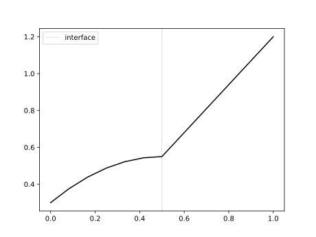
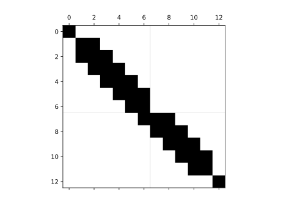

## Implementation of test function space with restricted test functions on interface

As described [here](https://www.overleaf.com/project/68bb2a3276c27897cb94d036), the proper 
theoretical treatment of mesh motion in monolithic ALE-FSI requires test function spaces
where the displacement test functions along the interface have zero contribution in the 
fluid domain. This is a minimal working example of this.

The example problem is constructed to be a poisson problem in both solid and fluid domains.
With the interface test function treatment, the fluid domain equation will be subordinate
to the solid domain equation and not influence the solid. The solution of the solid equation
gives dirichlet boundary condition to the fluid equation. The solid equation will have a 
zero Neumann boundary condition on the interface. This is appropriate, since in the FSI
context the force balance will give a Neumann term through the fluid stress.

The source terms are chosen to be $f_S = 2$ and $f_F = 0$, resulting in a parabola in the 
solid domain and a straight line in the fluid domain. The solution will be continuous in
function value but not flux along the interface. Final boundary conditions are $u = 0.3$ 
at $x = 0$ and $u = 1.2$ at $x = 1$.

### Requirements
Tested on ``dolfinx 0.11.0``.

### One-dimensional solution of above problem with restricted test functions on interface

### Sparsity pattern of above problem with degree 1 Lagrange elements in one dimension.

